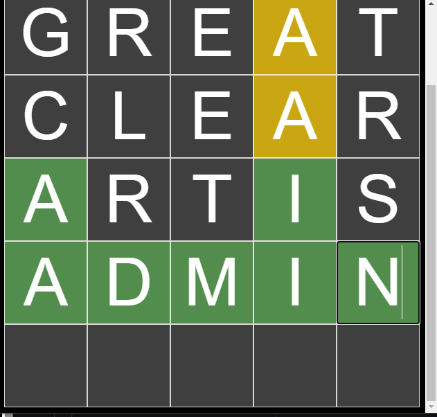

# Word-Guesser-Extension
Chrome Extension for Wordle Game

## General
Play a WORDLE-like game in your browser! There are soon to be over 2000+ words to choose from! 
Yellow - Correct letter, wrong spot  
Green  - Correct letter correct spot  

no change - Wrong letter

## Visuals
> 

Example of a successful completion of the Game.

> 

## Word-List
I am working on updating the List to have more common words and unique ones

## Version 1.0.0
  Standard 5-letter words   
  5 guesses unlike traditional "WORDLE"   

## Future Features (plan)
  Math Guesser is in the works...  
  customizable grid-size...
