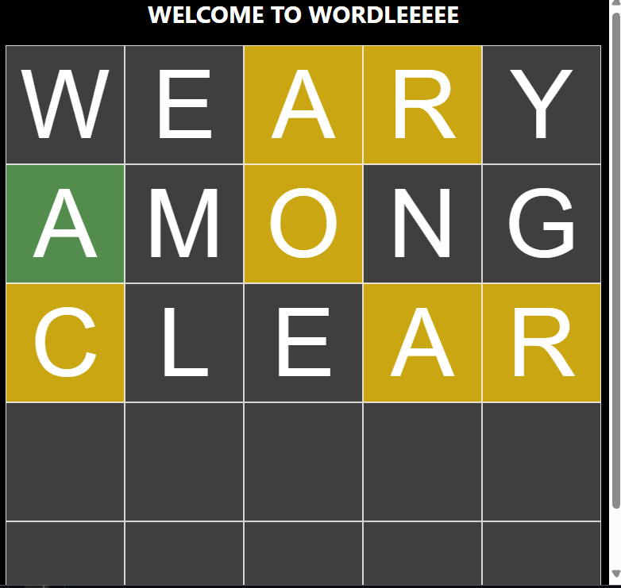

# Word-Guesser-Extension
Chrome Extension for Wordle Game

## General

${\color{#538D4E}{Green}}$ - Correct Letter Correct Spot  
${\color{rgba(253,208,23,0.8)}{Yellow}}$ - Correct letter, Wrong Spot  
No Change - Wrong Letter

## Visuals
> 

Example of a successful completion of the Game.

> 

## Word-List
I am working on updating the List to have more common words and unique ones

## Version 1.0.0
  Standard 5-letter words   
  5 guesses unlike traditional "WORDLE"   

## Future Features (plan)
  Math Guesser is in the works...  
  customizable grid-size...
